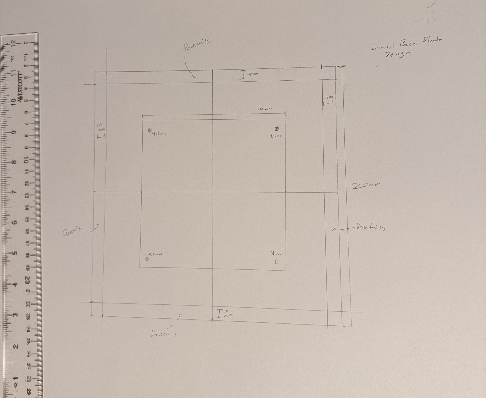

# LabPSU-Mini
Modular desktop power supply with selectable voltage rails and microcontroller monitoring

# Desktop PSU Project 🔌🧠

A modular, 3-voltage desktop power supply (9V / 5V / 3.3V) with:
- LM2596-ADJ 4pin buck converters
- Arduino Nano for temperature monitoring
- Rotary voltage selector
- Active cooling + heatsinks
- 3D printed ABS enclosure

---

## 🔧 Features
- Rotary switch-selectable voltage rails
- Internal fan cooling system
- PD-ready, low profile power input
- All components enclosed in heat-tolerant ABS

---

## 🧱 Build Log

### Enclosure
- [X] Designed Baseplate with vent for 120mm fan.
- [ ] Designed buck converter brackets in FreeCAD

### Electronics
- [ ] Created front panel layout (voltage oled and rotary switch)
- [ ] Add OLED display for voltage/temp readout
- [ ] Mount microcontroller inside

### Software
- [ ] Create voltage and temprature readout lcd software with arduino nano

### Initial Baseplate Images

This will eventually have dovetails drawn, and a ventalation hole (the 120mm square hole), ill probably cut it down a lot so the fan can screw in.

---

## 📐 Folder Structure

- `enclosure/` → 3D models (FreeCAD, STL)
- `electronics/` → Schematics (KiCad), PCB layouts
- `firmware/` → Arduino/Pico code
- `images/` → Renders, wiring diagrams, final photos
- `docs/` → Reports, notes, datasheets

---

## 🧾 Licensing
-   
  **Code (`firmware/`)** is licensed under the MIT License.

-   
  **Design files (`enclosure/`, `electronics/`, `images/`)** and documentation are licensed under  
  [Creative Commons Attribution-ShareAlike 4.0 International (CC BY-SA 4.0)](https://creativecommons.org/licenses/by-sa/4.0/).  
  *LabPSU-Mini © 2025 by Alexander Rapino is licensed under CC BY-SA 4.0.*

Please attribute accordingly and respect the terms when remixing or redistributing.